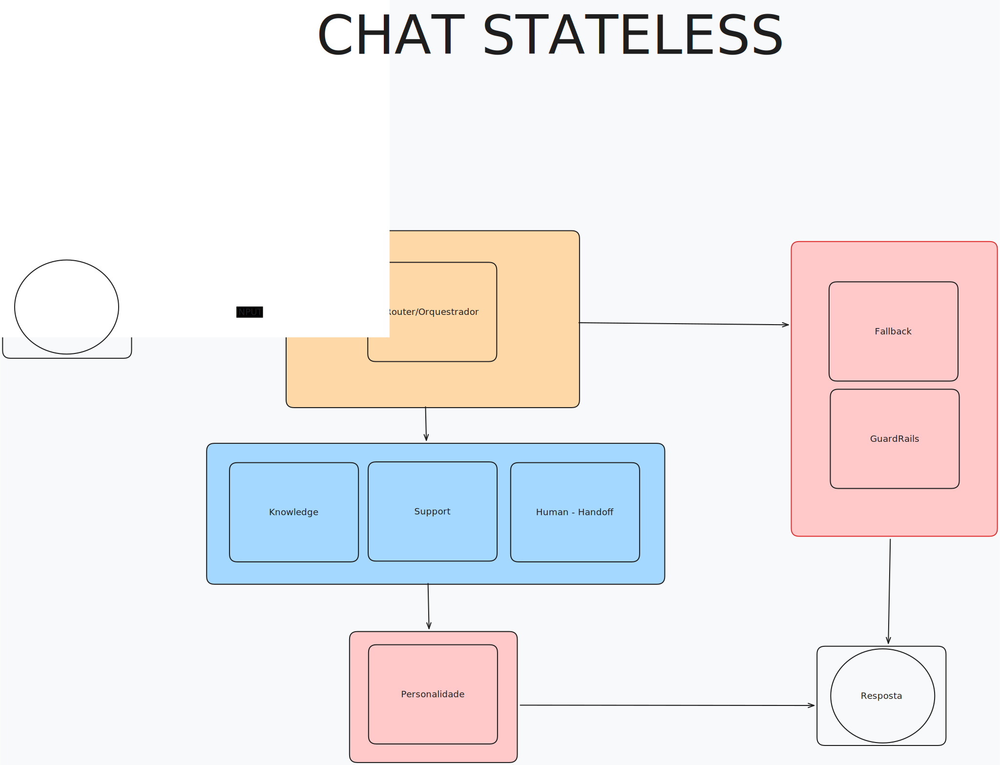

# ⚡ CloudWalk Agent Swarm

**Uma arquitetura multi-agente robusta e modular para atendimento
financeiro inteligente.**\
Este projeto implementa um "Enxame de Agentes" (Agent Swarm) capaz de
orquestrar atendimentos, separar responsabilidades e garantir
segurança através de Guardrails rígidos.

------------------------------------------------------------------------

## 🧠 Arquitetura do Sistema

O sistema utiliza **LangGraph** para gerenciar o fluxo de estado. A
decisão de roteamento é **Stateless** (focada na intenção imediata),
enquanto a experiência do usuário é **Stateful** (memória de conversa).

### 🧠 Arquitetura Stateful

<a href="./assets/arquitetura-statefull.svg">
  
</a>

### 🧊 Arquitetura Stateless

<a href="./assets/arquitetura-stateless.svg">
  
</a>

------------------------------------------------------------------------

## ✨ Funcionalidades Principais

### 1. Roteamento Inteligente & Stateless

O Router Agent analisa cada mensagem isoladamente. Ele não se deixa
enviesar pelo passado para decidir o destino, garantindo que uma mudança
brusca de assunto (ex: de "Erro no Pix" para "Quanto custa o Bitcoin?")
seja tratada corretamente.

### 2. Agentes Especializados

-   📚 **Knowledge Agent:** Utiliza RAG (Retrieval-Augmented Generation)
    com ChromaDB para responder sobre produtos InfinitePay e DuckDuckGo
    para buscas na web em tempo real.
-   🛠️ **Support Agent:** Conecta-se a um banco de dados (Mock) para
    realizar consultas sensíveis (Saldo, Status da Conta, Bloqueios).
-   🤷 **Fallback:** Camada desenvolvida visando economizar tokens, inputs gibberish caem aqui e são tratados de forma determinística
-   🛡️ **Guardrail:** Camada de segurança determinística. Bloqueia
    tentativas de jailbreak, prompt injection ou linguagem tóxica.

### 3. Personalidade & Editoração

Um agente final (Personality) atua como editor de texto, garantindo tom
de voz da marca e formatação correta.\
Respostas vindas de Guardrail e Fallback **pulam** essa etapa.

### 4. Frontend Modular (Streamlit)

Interface dividida em abas estratégicas:

-   🧩 Chat Stateless (com grafo em tempo real)
-   💬 Chat Stateful (experiência tipo WhatsApp)
-   🧪 Bateria de Testes (QA automatizado)

------------------------------------------------------------------------

## 📂 Estrutura do Projeto

    agent-swarm/
    ├── app/
    │   ├── agents/
    │   │   ├── knowledge/
    │   │   ├── router/
    │   │   ├── support/
    │   │   └── utils/
    │   ├── core/
    │   │   ├── config.py
    │   │   ├── database.py
    │   │   ├── state.py
    │   │   ├── vector_store.py
    │   │   └── workflow.py
    │   ├── frontend/
    │   │   ├── components/
    │   │   ├── main.py
    │   │   └── styles.py
    │   └── main.py
    ├── Dockerfile
    ├── docker-compose.yml
    ├── start.sh
    ├── ingest_data.py
    └── run_tests.py

------------------------------------------------------------------------

## 🚀 Como Executar

### Pré-requisitos

-   Docker & Docker Compose\
-   Uma chave de API da Groq Cloud (`GROQ_API_KEY`)

### 1. Criar `.env`

    CHAVE_GROQ=gsk_sua_chave_aqui...
    GROQ_MODEL=llama-3.1-8b-instant

### 2. Executar com Docker

    docker-compose up --build

Acesse:\
Frontend → http://localhost:8501\
API Docs → http://localhost:8000/docs

### 3. Executar Testes

Você pode rodar os testes de duas formas:

**🧪 Pela interface (Streamlit):**  
Acesse a aba **Bateria de Testes** no frontend.

**🖥️ Pelo terminal:**  
```bash
docker-compose exec backend python run_tests.py
```

------------------------------------------------------------------------

## 🛠️ Detalhes Técnicos

### 🔍 Pipeline RAG

-   Scraping via `ingest_data.py`
-   Embeddings com `all-MiniLM-L6-v2`
-   ChromaDB busca top-4 chunks
-   Citação obrigatória de `metadata['source']`, para agente de Knowledge e Support

### 🛡️ Guardrails

-   *Keyword Blocking*
-   *Sanitização de Saída*
-   *Isolamento de Memória* ( Não enviando mensagens trigger para o contexto )

------------------------------------------------------------------------
## 🔧 Built With

- **Python 3.10+** + **FastAPI** – Backend  
- **LangGraph** – Orquestração de Agentes  
- **Streamlit** – Frontend Interativo  
- **Docker** – Containêrização
